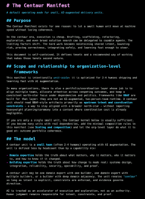

# mdf



Markdown *FAST!* is a high-performance Markdown → ANSI renderer optimized for streaming and terminal reflow, plus a PDF renderer for the same streaming pipeline.

## Design

- Stream parse from an `io.Reader`.
- Emit tokens as soon as block decisions are made, using only bounded lookahead
  for ambiguous Markdown constructs such as no-edge pipe tables.
- Wrap only at the final step with ANSI-aware reflow.
- Zero/near-zero alloc in hot paths.
- PDF renderer uses the same streaming pipeline: `io.Reader` → tokens → `io.Writer`.

## Installation of CLI

```bash
go install pkt.systems/mdf/cmd/mdf@latest

# From the repository:
make
sudo make install
```

## CLI example

```bash
mdf -t synthwave-84 testdata/agents.md

# Generate PDF:
mdf -o agents.pdf --pdf --pdf-font-size 10 https://pkt.systems/centaur.md

# Generate self-contained HTML:
mdf --html -o agents.html --html-content-width 96 testdata/agents.md

# Opt into embedded Hack Nerd Font for HTML:
mdf --html --html-font hack -o agents.html testdata/agents.md

# Choose table buffering and table wire style:
mdf --table-buffer row --table-wire ascii testdata/agents.md
```

List themes:

```bash
mdf --list-themes
```

## SDK: ANSI streaming

```go
f, _ := os.Open("testdata/agents.md")
defer f.Close()

_ = mdf.Render(mdf.RenderRequest{
	Reader:  f,
	Writer:  os.Stdout,
	Width:   80,
	Theme:   mdf.DefaultTheme(),
	Options: []mdf.RenderOption{mdf.WithOSC8(mdf.DetectOSC8Support())},
})
```

## SDK: PDF rendering

```go
f, _ := os.Open("testdata/agents.md")
defer f.Close()

out, _ := os.Create("out.pdf")
defer out.Close()

cfg := pdf.DefaultConfig()
cfg.PageSize = "A4"
cfg.Margin = 36
cfg.FontSize = 12
cfg.LineHeight = 1.4

_ = pdf.Render(pdf.RenderRequest{
	Reader: f,
	Writer: out,
	Theme:  mdf.DefaultTheme(),
	Config: cfg,
})
```

## SDK: HTML rendering

```go
f, _ := os.Open("testdata/agents.md")
defer f.Close()

cfg := html.DefaultConfig()
cfg.ContentMaxWidthCh = 96
cfg.TableBufferMode = mdf.TableBufferFull
cfg.EmbeddedFont = html.EmbeddedFontHack // optional; default is JetBrains Mono

_ = html.Render(html.RenderRequest{
	Reader: f,
	Writer: os.Stdout,
	Theme:  mdf.DefaultTheme(),
	Config: cfg,
})
```

HTML output is self-contained and embeds JetBrains Mono variable webfonts by
default. Set `--html-font hack` or `cfg.EmbeddedFont = html.EmbeddedFontHack`
to opt into the vendored Hack Nerd Font bundle. Markdown thematic breaks are
consumed as structural separators and are intentionally not emitted as visible
`<hr>` rules.

## Tables

Markdown pipe tables are parsed as structured streaming events for renderers
that implement `mdf.TableStream`.

- `TableBufferFull` buffers the complete table for best column sizing.
- `TableBufferRow` buffers enough rows to establish layout, then emits rows as
  they arrive.
- `TableWireLine` uses Unicode box drawing, `TableWireASCII` uses `+`, `-`,
  and `|`, and `TableWireSpace` removes visible table borders.

HTML supports `line` and `space` wire modes. PDF and ANSI support all three wire
modes.

## Streaming pipeline pattern

The core idea is a zero-buffer streaming pipeline:

```
io.Reader  -->  mdf.Parse  -->  token stream  -->  io.Writer
```

You can use `mdf.Render` directly, or plug your own `mdf.Stream` implementation.

## Streaming from OpenAI Responses API (Go)

This example shows a full pipeline from OpenAI streaming → mdf → `io.Writer` (stdout or a scrollbuffer).
The Responses API streams semantic events; the primary text delta event is
`response.output_text.delta`.

```go
package main

import (
	"context"
	"io"
	"log"
	"os"

	"github.com/openai/openai-go/v3"
	"github.com/openai/openai-go/v3/option"
	"github.com/openai/openai-go/v3/responses"
	"github.com/openai/openai-go/v3/shared"

	"pkt.systems/mdf"
)

func main() {
	ctx := context.Background()
	apiKey := os.Getenv("OPENAI_API_KEY")
	if apiKey == "" {
		log.Fatal("OPENAI_API_KEY not set")
	}

	// Reader from OpenAI streaming deltas.
	r, err := streamResponses(ctx, apiKey, "Explain streaming markdown in 3 bullets.")
	if err != nil {
		log.Fatal(err)
	}
	defer r.Close()

	// Sink: stdout (or your scrollbuffer writer).
	if err := mdf.Render(mdf.RenderRequest{
		Reader:  r,
		Writer:  os.Stdout,
		Width:   80,
		Theme:   mdf.DefaultTheme(),
		Options: []mdf.RenderOption{mdf.WithOSC8(mdf.DetectOSC8Support())},
	}); err != nil {
		log.Fatal(err)
	}
}

// streamResponses returns an io.Reader that emits response text deltas.
func streamResponses(ctx context.Context, apiKey, input string) (io.ReadCloser, error) {
	pr, pw := io.Pipe()
	go func() {
		defer pw.Close()
		client := openai.NewClient(option.WithAPIKey(apiKey))
		params := responses.ResponseNewParams{
			Model: shared.ResponsesModel("gpt-5"),
			Input: responses.ResponseNewParamsInputUnion{
				OfString: openai.String(input),
			},
			Stream:     openai.Bool(true),
			Truncation: responses.ResponseNewParamsTruncationAuto,
		}

		stream := client.Responses.NewStreaming(ctx, params)
		for stream.Next() {
			ev := stream.Current()
			switch v := ev.AsAny().(type) {
			case responses.ResponseTextDeltaEvent:
				if v.Delta != "" {
					_, _ = pw.Write([]byte(v.Delta))
				}
			}
		}
		if err := stream.Err(); err != nil {
			_ = pw.CloseWithError(err)
		}
		_ = stream.Close()
	}()
	return pr, nil
}
```

Notes:
- Streaming events are typed; for text deltas, listen for `response.output_text.delta`.
- Set `stream=true` in the Responses request to enable streaming.
